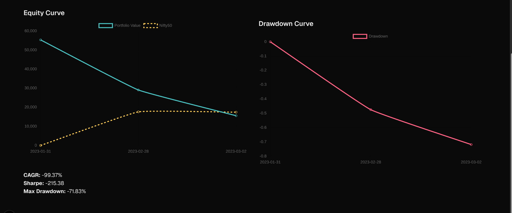

# Backtesting Framework for Equity-Based Strategies

This project enables fast and flexible backtesting of equity investment strategies based on fundamental filters, ranking logic, and customizable portfolio construction rules.

## 🔧 Setup Instructions

### 1. Clone the Repository

```bash
git clone https://github.com/yuktasarode/qode-test.git
```

### 2. Setup Frontend
```bash
cd backtesting
npm install
npm run dev
```
This runs the frontend on http://localhost:3000

### 3. Setup Database
- setup local postgres server
- create a .env file to add database url (DB_URL).


### 4. Setup Backend

```bash
cd backtesting
python -m venv myvenv
source myvenv/bin/activate
pip install -r requirements.txt
python script.py
uvicorn main:app --reload
```

This runs on http://localhost:8000


## Features

- FastAPI backend with rate-limiting

- Fundamental filtering: ROE, ROCE, PAT, PE, Market Cap, date range

- **Custom strategy configuration**:

  - Position sizing: Equal, ROCE-weighted, MarketCap-weighted

  - Ranking and composite ranking

  - Rebalance frequency: Monthly, Quarterly, Yearly

- **Automatic exports**:

  - Portfolio compositions (CSV)

  - Top companies each period (CSV)

  - Strategy config (CSV)

  - Top movers (winners & losers) (CSV)

- **Performance metrics**: CAGR, Sharpe Ratio, Max Drawdown

- Nifty50 baseline equity curve for comparison

## Backtesting and Rebalancing Logic

- Get the configurations from the user
- **Rebalance Date Generation**:
  - Using the start_date and rebalance_frequency, a list of rebalance intervals is created using relativedelta.These dates define the boundaries of each backtesting period.
- **Per Rebalance Period Workflow**:
  - Fundamental Screening: 
    - Fetch Latest available data (≤ period start year)
    - Companies are filtered by user-defined thresholds 
  - Ranking:
    - Companies are ranked using criteria like roe:desc, pe:asc
    - composite score is computed if multiple metrics are used.
  - Portfolio Selection: Top N companies are selected based on ranking
  - Weight Allocation: Portfolio weights are assigned as per the strategy (equal, market cap, or metric-based).
  - Price Fetching: Historical (*OHLCV*) price data is downloaded via `yfinance` from `period_start` to `period_end`.


    > Note: Only closing prices were used in this version as the focus was on fundamental-driven strategies rather than intraday or candlestick-based models. 
  - Return Calculation:
    - Capital is allocated based on weights and start prices.
    - End-of-period portfolio value is computed using end prices.
    - Capital is updated for the next rebalance period. 
  - Top Movers Tracking: Best and worst performing stocks in each period are logged.

- **Final Metrics and Output**:
  - Compute CAGR, Sharpe Ratio, and Max Drawdown
  - Export CSV and ZIP:
    - Portfolio Composition
    - Top Companies per Period
    - Top Movers
    - Config Used 


## Data Collection and cleaning

```fetchFun.py``` is used to gather and calculate the fundamentals data for 100 companies. 

### Summary :
- **Source**: Scraped financial data from [Screener.in](https://www.screener.in) using rate limiting and anti-bot mechanisms (custom headers, retry logic, polite random delays, caching system (`screener_cache.json`) to avoid repeated scraping ).
- **Metrics Collected**: ROCE, ROE, PAT, EPS, PE ratio, Market Cap.
- Raw metrics extracted from sections like Balance Sheet, Profit & Loss, and Ratios from [Screener.in](https://www.screener.in):
  - PAT (Net Profit)
  - EPS (Earnings per Share)
  - Equity Capital
  - Reserves
  - ROCE
- Derived metrics computed from scraped + price data (`yfinance`):
  - ROE = PAT / (Equity + Reserves)
  - PE Ratio = Price / EPS
  - Market Capitalization = Price × (Equity × 10 million shares)
- **Data Normalization**: Extracted values are cleaned, converted to float, and missing values are defaulted to 0 before modeling.
- Output is flattened and saved to `New-fundamental_data.csv`.
- **Stock Prices**: Loaded historical stock prices from `prices_by_ticker.csv` for PE and Market Cap calculations. `prices_by_ticker.csv` was created using yfinance api. Prices are stored per ticker in `prices_by_ticker.csv`, indexed by year.

### Future Data Leakage Prevention

- **Time-Aligned Metrics**: 
All fundamental metrics (ROE, ROCE, PAT, PE, etc.) are aligned to the financial year they are reported for.
- **Price Data Usage**: 
Only historical prices up to the rebalance date are used for portfolio construction.
- **Metric Derivation Log**:
Even when metrics are derived (e.g., ROE = PAT / Equity + Reserves), the source data year is preserved.
- **Backtest Isolation**:
Each rebalance period is handled independently using the most recent available data up to that point.

## Tech Stack
- **Frontend**: React, Tailwind CSS, Chart.js
- **Backend**: FastAPI, Pandas, SQLAlchemy
- **Database**: PostgreSQL (schema: companies, fundamentals, prices)
- **Data Scraping** : Screener.in, yfinance 

## File Structure
```
Qode/
├── backendserver/ # FastAPI backend
│ ├── main.py # Main server and backtesting logic
│ ├── fetchFun.py # Fundamental data scraper (Screener.in)
│ ├── script.py # Script to initialize DB tables
│ ├── sqlalchemy/ # SQLAlchemy models and schema
│ ├── requirements.txt # Required Python libraries
│ ├── .env # Environment file (DB_URL)
│ ├── data/
│ │ └── New-fundamentals_data.csv # Pre-fetched data from 2019 to 2024
│ ├── assets/ # Screenshots and demo images for README
│ │ ├── config-ui.png
│ │ └── equity-curve.png
│ ├── exports/ # Exported backtest results (excluded from git)
│ └── tmp/ # Temp files generated during backtests (excluded from git)
│
├── backtesting/ # React frontend
│ └── app/ # All frontend UI components
```

## Assumptions:

- A fixed universe of 100 companies.
- Fundamental data collected for financial years 2019 to 2024.
- Stock price data used from 2019 to 2024, fetched via Yahoo Finance (`yfinance`) for backtest computations.
- Derived metrics are computed from raw scraped data.

## Future Improvements
- Portfolio logs with returns & per-stock attribution
- Strategy presets 


## Demo Screenshots
### Strategy Configuration UI


### Equity Curve Output

